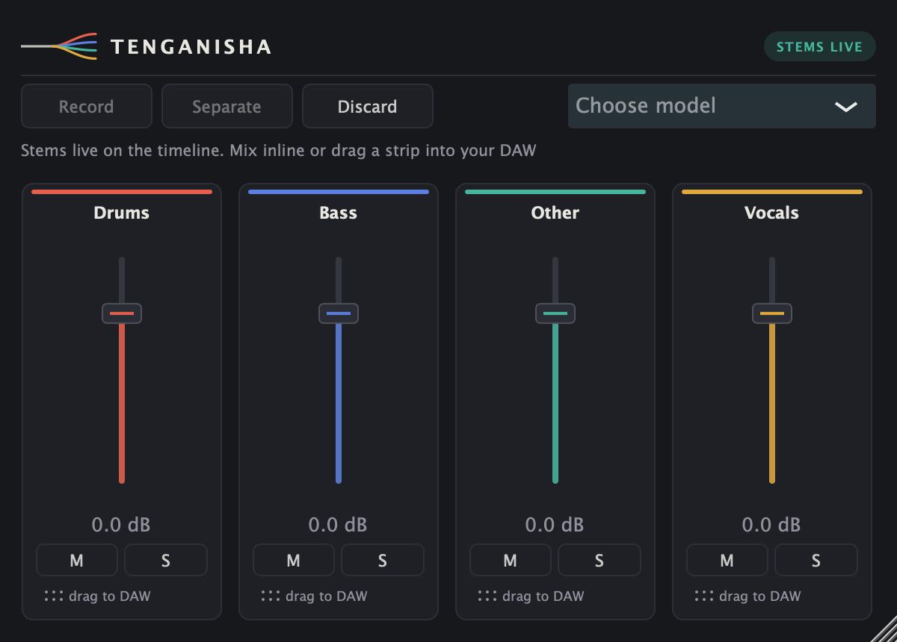

# Tenganisha

[](https://github.com/Dnakitare/tenganisha/actions/workflows/ci.yml)



A VST3/AU stem separation plugin. Record a section straight off the host timeline, separate it into drums / bass / other / vocals with HTDemucs (via demucs.cpp), then mix the stems **inline, playhead-aligned** — no bounce-out/re-import round trip.

> Name check: "Tenganisha" (Swahili: *to separate*) has **not** been through a trademark / npm / prior-art sweep. Rename freely; it's one string in `CMakeLists.txt` plus the class prefix.

## Why this architecture

- **Inference backend: [demucs.cpp](https://github.com/sevagh/demucs.cpp)** (ggml + Eigen, C++17). Chosen over ONNX Runtime deliberately: HTDemucs is a hybrid time/spectral model and its STFT ops make ONNX export fragile. demucs.cpp runs the reference v4 hybrid-transformer weights natively in C++, no Python, no runtime DLL hell, one static lib.
- **Non-real-time by design.** HTDemucs is not a causal model; anything claiming "real-time Demucs-quality separation" is trading away quality. The workflow is capture → separate (seconds to minutes depending on length/CPU) → timeline-aligned playback.
- **Lock-free audio thread.** Stems are published as an immutable `shared_ptr<StemSet>` swapped atomically; parameters go through APVTS raw-value atomics with 20 ms gain smoothing. No locks, no allocation in `processBlock`.
- **Timeline alignment.** Capture records the host playhead sample position at record start; playback indexes stems by `playhead − start`, so the separated material lands exactly where the original sat. Loop, scrub, and relocate freely.

## Workflow

1. Pick a model from the menu: **Standard** or **Fine-tuned (best, 4x slower)**. Neither ships inside the plugin; the first time you pick one it downloads itself to `~/Library/Application Support/Tenganisha/models` with a progress readout. After that it loads instantly, and your choice is remembered with the session. (**Custom model file…** still lets you point at any ggml `.bin`.)
2. **Record**, play the section in your DAW, **Separate**.
3. Mix with per-stem gain / mute / solo, or grab the **drag handle** at the bottom of a strip to drop a 24-bit WAV of that stem onto a new track.
4. **Discard** returns to clean passthrough.

Standard vs fine-tuned: standard is one model, ~2x realtime, and its four stems sum back to the mix almost exactly. Fine-tuned is a four-model ensemble (one specialist per stem), ~6-7x realtime, noticeably cleaner soloed stems. Use standard for inline full-mix playback, fine-tuned when you're soloing or exporting.

## Building

Requires CMake ≥ 3.22 and a C++17 compiler. JUCE, Eigen, and demucs.cpp are fetched automatically.

```bash
cmake -B build -DCMAKE_BUILD_TYPE=Release
cmake --build build --config Release -j
```

The VST3 is copied to the system plugin folder automatically (`COPY_PLUGIN_AFTER_BUILD`). macOS: works with Apple Clang, universal binaries need the usual `CMAKE_OSX_ARCHITECTURES` dance. Windows: demucs.cpp is developed against GCC/Clang — prefer the LLVM/clang-cl toolchain over MSVC.

Inference speed (macOS defaults, measured on an M2, 20 s clip):

| Config | Time | Realtime |
|---|---|---|
| plain Eigen | 49.8 s | x2.49 |
| + OpenMP (`TENGANISHA_OPENMP`) | 47.4 s | x2.37 |
| **+ Accelerate BLAS (default)** | **34.0 s** | **x1.70** |
| Accelerate + OpenMP | 32.2 s | x1.61 |

Accelerate does the heavy lifting and is on by default. **OpenMP is off by default and dev-only on macOS**, on purpose: with `EIGEN_USE_BLAS` the big matrix products already run on Accelerate's AMX units (which thread internally), so OpenMP only parallelizes the leftover Eigen ops for about 5%. That 5% isn't worth what it costs to ship, because Apple Clang has no native OpenMP, so the binary would link Homebrew's `libomp.dylib` by absolute path (breaks on any machine without that brew prefix), and two plugins each carrying an OpenMP runtime can hit the "multiple libomp initialised" abort inside a DAW. The default macOS build is Accelerate-only with no external dylib dependency and is distributable as-is; turning `TENGANISHA_OPENMP=ON` prints a warning and is for local dev only. On Linux/Windows the OpenMP runtime comes from the toolchain, so none of this applies and OpenBLAS/MKL via `EIGEN_USE_BLAS` is an option there.

## Models

| File | Stems | Notes |
|---|---|---|
| `ggml-model-htdemucs-4s-f16.bin` | 4 | default, best quality/speed balance |
| `ggml-model-htdemucs_ft_*-4s-f16.bin` | 4 | fine-tuned ensemble: 4 specialist models, 4x separation time, best quality. Fetch with `download_model.sh --ft`, then load any one of the four files; its siblings are found automatically |
| `ggml-model-htdemucs-6s-f16.bin` | 6 | guitar+piano folded into "Other" in this UI |

## Status (2026-07-05)

- Builds clean (zero warnings) on macOS arm64 and as a universal arm64+x86_64 binary; the x86_64 slice passes pluginval under Rosetta.
- pluginval strictness 10: VST3 and AU both SUCCESS; auval passes.
- `tenganisha_offline_test`: stems sum back to the input at -34.7 dB residual on real music (-28 dB on the synthetic self-test), ~x2.5 realtime inference on an M2.
- `tenganisha_host_sim_test`: sample-exact timeline alignment (output matches stem sum at -132 dB), loop/relocate bit-identical, state machine correct through record/separate/playback/discard.
- Live REAPER validation (driven via ReaScript + accessibility automation): record off the timeline → separate → offline bounce nulls vs input at -43.7 dB; realtime looped playback matches at -45.6 dB; drag-a-stem delivers a valid 24-bit WAV onto a track. See HANDOFF.md for details, including the stopped-transport capture bug this caught.
- Still human: does the separation *sound* good. Everything mechanical is verified.

## Honest limitations / roadmap

- Separation is CPU-only; a 3-minute song is roughly real-time × 1–4 on a modern laptop (× 6–7 with the fine-tuned ensemble).
- Fine-tuned stems are cleaner individually but sum slightly less exactly to the input than the standard model's (measured -21 dB vs -31 dB reconstruction residual): each specialist optimises its own stem, so the four outputs aren't a perfect partition of the mix. Prefer standard for inline full-mix playback fidelity, fine-tuned for soloed/exported stems.
- `cancel()` is drop-on-completion, not mid-segment abort.
- Roadmap: waveform display of capture with stem overlays, fine-tuned per-stem models (`htdemucs_ft`) as an ensemble "quality" mode, offline file-drop mode (drag a WAV into the plugin instead of recording), stem re-render into host via ARA (the real endgame for inline editing).

## Legal note

HTDemucs weights are MIT-licensed (Meta research); demucs.cpp is MIT. Fine for commercial use, but do your own diligence before shipping.
